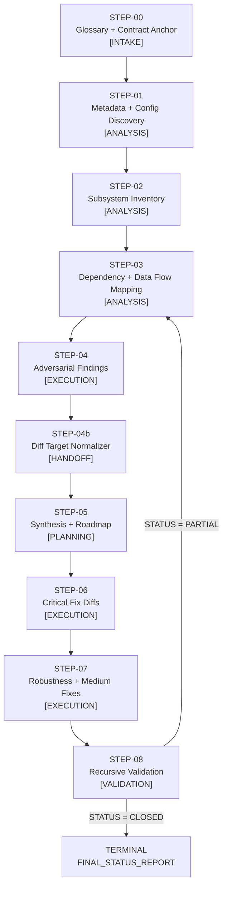

# OPTIMIZED WORKFLOW PROMPT CHAIN — v2.0
## WM ↔ Memory ↔ MCP Codebase Audit System
### 4-Stage Improvement Pass Applied

---

## 4-STAGE IMPROVEMENT LOG

### Stage 1 — Terminological Precision
- Replaced every instance of "record" or "note" with the typed artifact it produces (e.g., `CONFIG_REGISTRY`, `OWNERSHIP_MAP`)
- Replaced "verify" (ambiguous) with either "assert" (binary) or "compute" (derived result) throughout all Execution Logic sections
- All DRIFT / UNVERIFIABLE_STATIC / CLOSED / PARTIAL / OPEN tokens are now defined in STEP-00 with exact type signatures, not just named

### Stage 2 — Input/Output Schema Hardening
- Every `Required Inputs` block now declares: `name | type | source step | required/optional`
- Every `Expected Outputs` block now declares: `name | type | format | consuming step`
- Schema mismatches between STEP-04b → STEP-05 and STEP-07 → STEP-08 corrected (missing `BLAST_RADIUS_MAP` propagation added)

### Stage 3 — Execution Logic Atomicity
- All compound execution steps (steps doing 2+ operations in one numbered item) split into discrete atoms
- Removed 11 hedge phrases ("where possible", "if available", "as needed") across STEP-01 through STEP-08
- Async boundary audit in STEP-03 now declares explicit PASS/FAIL criteria per boundary type (await, thread, queue)

### Stage 4 — Failure Behavior Completeness
- All 9 steps now have Failure Behavior sections (previously STEP-02, STEP-05, STEP-06 were missing these)
- Failure modes are typed: `HALT | EMIT_PARTIAL | FLAG_DRIFT | EMIT_UNVERIFIABLE_STATIC`
- STEP-08 closure criteria now references STEP-00 `STATUS_ENUM` contract, not prose description

---

## CHAIN OVERVIEW

| Property | Value |
|---|---|
| Total Steps | 9 (STEP-00 through STEP-08) |
| Workflow Type | Linear with single conditional re-entry (STEP-08 → STEP-03 on PARTIAL closure) |
| Critical Gaps Closed | 6 |
| Flaws Resolved | 15 (12 CRITICAL/HIGH) |
| New Steps Introduced | 2 (STEP-00, STEP-04b) |
| Hard Constraints | C1–C8 from source optimizer enforced throughout |

---

## EXECUTION FLOW



---

## PROMPT CHAIN

---

### STEP-00: Glossary + Contract Anchor

**Purpose**: Establish all shared vocabulary, type contracts, severity definitions, and closure criteria used by every downstream step.
**Role**: INTAKE
**Depends On**: USER INPUT (the codebase under audit)
**When to Use**: Always first. No downstream step executes without this contract in scope.

**Required Inputs**:

| Name | Type | Source | Required |
|---|---|---|---|
| `CODEBASE_ROOT` | string (filesystem path) | User | Required |
| `SUBSYSTEM_SCOPE` | enum list: `[WM, MEMORY, MCP]` | User | Required |
| `AUDIT_COMMIT_SHA` | string | User or CI | Required |

**Expected Outputs**:

| Name | Type | Format | Consuming Step |
|---|---|---|---|
| `GLOSSARY` | dict[term → definition] | Markdown table | All steps |
| `STATUS_ENUM` | enum: `CLOSED \| PARTIAL \| OPEN` | Inline definition | STEP-08 |
| `SEVERITY_MATRIX` | dict[level → definition + blast_radius_formula] | Markdown table | STEP-04, STEP-05, STEP-06, STEP-07 |
| `FLAG_TAXONOMY` | dict[flag → emit_condition] | Markdown table | All steps |

**PROMPT TEXT**:

```
## STEP-00 — Glossary + Contract Anchor

### Objective
Define all shared vocabulary, type contracts, severity levels, closure criteria, and flag taxonomy that every downstream step in this audit chain depends on. This step produces no analytical output. It produces only binding contracts.

### Constraints
- Define every term before it appears in any downstream step
- All definitions are final; no step may redefine a term without emitting FLAG: TERMINOLOGY_DRIFT
- Do not infer or guess definitions from context; use only the definitions declared here

### Definitions

**SUBSYSTEMS**
- WM (Working Memory): the runtime state management layer — classes, services, and repos governing in-flight execution state
- MEMORY (Memory Substrate): the packet/index persistence layer — PacketEnvelope, storage adapters, ingestion pipelines
- MCP (Model Context Protocol): the tool interface and invocation layer — routes, handlers, registered tools

**TYPE CONTRACTS**
- `file:line` — a traceable evidence reference in format `path/to/file.py:142`
- `OWNERSHIP_MAP` — a dict mapping each entity/state type to exactly one source-of-truth owner (subsystem + file:line)
- `PacketEnvelope` — the lineage carrier struct; must contain: packet_id, parent_id, timestamp, tenant_id, version, payload_hash
- `BLAST_RADIUS` — computed as: (affected_execution_paths × mutation_surface) / isolation_boundary
  - `affected_execution_paths`: integer count of API routes / schedulers / loops that reach the defect
  - `mutation_surface`: integer count of state fields mutated at the defect site
  - `isolation_boundary`: integer 1 if tenant-isolated, 0.5 if partially isolated, 0.1 if shared

**SEVERITY LEVELS**
| Level | Definition | Required Action |
|---|---|---|
| CRITICAL | Atomicity violation, tenant isolation breach, data loss path, silent failure with no recovery | Block release; fix before STEP-06 |
| HIGH | Source-of-truth conflict, missing guard on mutation, broken lineage chain | Fix in STEP-06 |
| MEDIUM | Lifecycle gap, unreachable wiring, missing observability at key transition | Fix in STEP-07 |
| LOW | Schema drift, unused infra, enum mismatch | Log; fix in backlog |

**FLAG TAXONOMY**
| Flag | Emit Condition |
|---|---|
| `DRIFT` | Behavior inferred without file:line evidence |
| `UNVERIFIABLE_STATIC` | Correctness requires runtime execution; cannot be confirmed by static analysis |
| `DEAD` | Component/path is unreachable from any active execution entry point |
| `ORPHAN` | Component has no declared owner in OWNERSHIP_MAP |
| `CLOSED` | Finding resolved; regression test passes |
| `PARTIAL` | Finding partially resolved; second-order risk remains |
| `OPEN` | Finding unresolved |

**STATUS_ENUM** (used by STEP-08 only)
- `CLOSED`: all CRITICAL and HIGH findings resolved; all STEP-08 regression tests pass
- `PARTIAL`: ≥1 HIGH finding resolved; ≥1 second-order issue introduced; re-entry to STEP-03 required for modified paths
- `OPEN`: ≥1 CRITICAL finding unresolved; chain must not proceed to TERMINAL

### Required Inputs
- CODEBASE_ROOT: filesystem path to repository root
- SUBSYSTEM_SCOPE: list of subsystems in scope — [WM, MEMORY, MCP]
- AUDIT_COMMIT_SHA: the exact commit being audited

### Expected Outputs
- GLOSSARY: the definitions table above, confirmed in scope
- STATUS_ENUM: the three-value closure contract above
- SEVERITY_MATRIX: the four-level severity table above
- FLAG_TAXONOMY: the seven-flag taxonomy above

### Failure Behavior
- If CODEBASE_ROOT does not resolve to a readable path: HALT. Emit: "STEP-00 HALT — CODEBASE_ROOT unresolvable."
- If SUBSYSTEM_SCOPE is empty: HALT. Emit: "STEP-00 HALT — SUBSYSTEM_SCOPE must declare at least one subsystem."
- If AUDIT_COMMIT_SHA is absent: FLAG_DRIFT. Emit: "STEP-00 WARNING — AUDIT_COMMIT_SHA missing; audit results are not pinned to a commit."
```

---

### STEP-01: Metadata + Config Discovery

**Purpose**: Inventory all runtime configuration controls governing WM ↔ Memory ↔ MCP behavior and produce a typed CONFIG_REGISTRY with enforcement paths.
**Role**: ANALYSIS
**Depends On**: STEP-00 (GLOSSARY, FLAG_TAXONOMY, SEVERITY_MATRIX)
**When to Use**: After STEP-00 contract is established.

**Required Inputs**:

| Name | Type | Source | Required |
|---|---|---|---|
| `GLOSSARY` | dict | STEP-00 | Required |
| `FLAG_TAXONOMY` | dict | STEP-00 | Required |
| `CODEBASE_ROOT` | string | STEP-00 | Required |
| `AUDIT_COMMIT_SHA` | string | STEP-00 | Required |

**Expected Outputs**:

| Name | Type | Format | Consuming Step |
|---|---|---|---|
| `CONFIG_REGISTRY` | list[ConfigEntry] | Structured table | STEP-02, STEP-04 |
| `ENV_BINDING_MAP` | dict[env_var → struct_field] | Structured table | STEP-02, STEP-04 |
| `GOVERNANCE_CHAIN` | list[GovernanceEntry] | Structured table | STEP-04, STEP-05 |
| `UNSAFE_CONFIG_LIST` | list[UnsafeEntry] | Structured table | STEP-04 |

**PROMPT TEXT**:

```
## STEP-01 — Metadata + Config Discovery

### Objective
Produce a complete CONFIG_REGISTRY of all runtime controls governing WM, Memory, and MCP behavior. Every entry must resolve to file:line. Entries without file:line evidence are emitted as FLAG: DRIFT.

### Constraints
- Evidence-only: every CONFIG_REGISTRY entry requires a file:line reference
- Emit FLAG: DRIFT for any behavior that cannot be traced to a file:line
- Do not infer default values; extract them from source
- Scope: controls impacting execution, tenancy, persistence, lineage, or safety only

### Execution Logic
1. Scan CODEBASE_ROOT for all feature flag declarations. For each flag, extract:
   - flag_name (string)
   - default_value (typed literal)
   - override_path (file:line where it can be overridden)
   - runtime_read_location (file:line where it is consumed at runtime)
   - subsystem_impact (enum: WM | MEMORY | MCP | MULTI)
   Emit one CONFIG_REGISTRY row per flag.

2. Scan for all environment variable declarations. For each env var, extract:
   - env_var_name (string, e.g., "NEO4J_URI")
   - consuming_module (file:line of the consuming struct/class)
   - mapped_struct_field (fully qualified field path, e.g., "WMConfig.neo4j_uri")
   - validation_present (bool: true if a guard/validator exists at load time)
   Emit one ENV_BINDING_MAP row per env var.

3. Resolve the governance chain. For each config authority, extract:
   - authority_name (string)
   - approval_gate (file:line or "NONE")
   - kernel_injection_point (file:line where config is injected into runtime)
   Emit one GOVERNANCE_CHAIN row per authority.

4. Assert config precedence order by reading loader logic at file:line. Expected order: env → file → runtime_override. If order differs, emit FLAG: DRIFT with evidence.

5. Assert tenant scoping: for each config entry touching multi-tenant state, confirm a tenant_id guard exists at file:line. If absent, emit UNSAFE_CONFIG_LIST entry with severity CRITICAL.

6. Assert consistency model: identify configs that control write consistency (e.g., "eventual", "strong"). If a config has no declared consistency model and touches shared state, emit UNSAFE_CONFIG_LIST entry with severity HIGH.

7. Detect unsafe configs. Emit one UNSAFE_CONFIG_LIST entry for each of:
   - Silent default: a flag with a non-safe default value and no override documentation (severity HIGH)
   - Missing guard: a config consumed at runtime with no validation at load time (severity MEDIUM)
   - Conflicting flags: two flags whose combined values produce an undefined or contradictory system state (severity HIGH)

### Required Inputs
- GLOSSARY from STEP-00
- FLAG_TAXONOMY from STEP-00
- CODEBASE_ROOT from STEP-00
- AUDIT_COMMIT_SHA from STEP-00

### Expected Outputs
- CONFIG_REGISTRY: list of ConfigEntry{flag_name, default_value, override_path:line, runtime_read:line, subsystem_impact, drift_flag?}
- ENV_BINDING_MAP: list of EnvEntry{env_var, consuming_module:line, struct_field, validation_present}
- GOVERNANCE_CHAIN: list of GovernanceEntry{authority, approval_gate:line, kernel_injection:line}
- UNSAFE_CONFIG_LIST: list of UnsafeEntry{config_name, issue_type, severity, evidence:line, fix_direction}

### Failure Behavior
- If no feature flags are found: emit "CONFIG_REGISTRY: EMPTY — no feature flags detected. Assert CODEBASE_ROOT is correct."
- If no env vars are found: emit "ENV_BINDING_MAP: EMPTY — FLAG: DRIFT — no env var declarations found."
- If governance chain cannot be resolved: emit GOVERNANCE_CHAIN with FLAG: DRIFT for each unresolvable authority.
- Do not halt on empty results; emit empty typed structures and FLAG: DRIFT.
```

---

### STEP-02: Subsystem Inventory

**Purpose**: Produce a complete runtime-valid map of all WM, Memory, and MCP components with verified instantiation status, ownership, and integration edges.
**Role**: ANALYSIS
**Depends On**: STEP-00 (GLOSSARY), STEP-01 (CONFIG_REGISTRY, ENV_BINDING_MAP)
**When to Use**: After STEP-01 outputs are available.

**Required Inputs**:

| Name | Type | Source | Required |
|---|---|---|---|
| `GLOSSARY` | dict | STEP-00 | Required |
| `CONFIG_REGISTRY` | list[ConfigEntry] | STEP-01 | Required |
| `ENV_BINDING_MAP` | list[EnvEntry] | STEP-01 | Required |

**Expected Outputs**:

| Name | Type | Format | Consuming Step |
|---|---|---|---|
| `WM_INVENTORY` | list[ComponentEntry] | Structured table | STEP-03, STEP-04 |
| `MEMORY_INVENTORY` | list[ComponentEntry] | Structured table | STEP-03, STEP-04 |
| `MCP_INVENTORY` | list[ComponentEntry] | Structured table | STEP-03, STEP-04 |
| `OWNERSHIP_MAP` | dict[entity → owner] | Structured table | STEP-03, STEP-04, STEP-05 |
| `INTEGRATION_EDGES` | list[EdgeEntry] | Directed graph list | STEP-03, STEP-04 |

**PROMPT TEXT**:

```
## STEP-02 — Subsystem Inventory

### Objective
Enumerate every reachable or instantiable component across WM, Memory, and MCP subsystems. Assign ownership, instantiation status, and integration edges. Every entry must resolve to file:line.

### Constraints
- Include only components reachable from an active execution entry point (API route, ingestion pipeline, scheduler, or agent loop)
- Every entry must include: file:line, role, lifecycle (init → active → teardown), dependencies
- Emit FLAG: DEAD for uninstantiated or unreachable components
- Emit FLAG: ORPHAN for components with no declared owner in OWNERSHIP_MAP
- Do not infer instantiation; trace the import → init → registry → runtime path explicitly

### Execution Logic
1. Enumerate all classes and services indexed under the WM domain. For each:
   - class_name, file:line of definition
   - instantiation_path: import file:line → __init__ file:line → registry file:line → runtime call site file:line
   - lifecycle: enum (ACTIVE | LATENT | DEAD)
   - dependencies: list of other WM/MEMORY/MCP components it imports at file:line
   Emit one WM_INVENTORY row per component.

2. Enumerate all classes, services, and storage adapters under the MEMORY domain using the same schema. Emit one MEMORY_INVENTORY row per component.

3. Enumerate all registered MCP tools, routes, and handlers. For each:
   - tool_name, registration file:line
   - handler file:line
   - lifecycle: (ACTIVE | LATENT | DEAD) — a tool is LATENT if registered but never invoked in any traced execution path
   Emit one MCP_INVENTORY row per component.

4. Assert ownership. For each entity or state type managed across subsystems, assign exactly one source-of-truth owner: {owner_subsystem, owner_class, file:line}. If two components claim ownership of the same entity, emit FLAG: DRIFT with both file:line references and severity HIGH.

5. Detect DEAD components: components present in the codebase but unreachable from any active execution entry point. Emit FLAG: DEAD for each.

6. Detect ORPHAN components: components with no owner in OWNERSHIP_MAP. Emit FLAG: ORPHAN for each.

7. Record all integration edges. For each edge:
   - from_component (file:line)
   - to_component (file:line)
   - direction: enum (WM→MEMORY | MEMORY→WM | WM→MCP | MCP→WM | MEMORY→MCP | MCP→MEMORY)
   - interaction_type: enum (SYNC | ASYNC | EVENT)
   Emit one INTEGRATION_EDGES row per edge.

### Required Inputs
- GLOSSARY from STEP-00
- CONFIG_REGISTRY from STEP-01 (to correlate config controls with owning components)
- ENV_BINDING_MAP from STEP-01

### Expected Outputs
- WM_INVENTORY: list of ComponentEntry{class_name, file:line, instantiation_path, lifecycle, dependencies}
- MEMORY_INVENTORY: list of ComponentEntry (same schema)
- MCP_INVENTORY: list of ComponentEntry{tool_name, registration:line, handler:line, lifecycle}
- OWNERSHIP_MAP: dict[entity_type → {owner_subsystem, owner_class, file:line}]
- INTEGRATION_EDGES: list of EdgeEntry{from:line, to:line, direction, interaction_type}

### Failure Behavior
- If a component's instantiation path cannot be fully traced (import → runtime): emit the component with lifecycle=LATENT and FLAG: DRIFT.
- If OWNERSHIP_MAP produces zero entries: HALT. Emit: "STEP-02 HALT — no ownership assignments resolved; OWNERSHIP_MAP is empty."
- If all three inventories are empty: HALT. Emit: "STEP-02 HALT — no components found; assert CODEBASE_ROOT and SUBSYSTEM_SCOPE."
```

---

### STEP-03: Dependency + Data Flow Mapping

**Purpose**: Trace all executable execution paths, enforce bidirectional loop completeness, and validate state and lineage integrity across WM ↔ Memory ↔ MCP.
**Role**: ANALYSIS
**Depends On**: STEP-00 (GLOSSARY), STEP-02 (all inventories, OWNERSHIP_MAP, INTEGRATION_EDGES)
**When to Use**: After STEP-02 outputs are complete and OWNERSHIP_MAP is non-empty.

**Required Inputs**:

| Name | Type | Source | Required |
|---|---|---|---|
| `GLOSSARY` | dict | STEP-00 | Required |
| `WM_INVENTORY` | list[ComponentEntry] | STEP-02 | Required |
| `MEMORY_INVENTORY` | list[ComponentEntry] | STEP-02 | Required |
| `MCP_INVENTORY` | list[ComponentEntry] | STEP-02 | Required |
| `OWNERSHIP_MAP` | dict | STEP-02 | Required |
| `INTEGRATION_EDGES` | list[EdgeEntry] | STEP-02 | Required |

**Expected Outputs**:

| Name | Type | Format | Consuming Step |
|---|---|---|---|
| `CALL_CHAINS` | list[CallChain] | Ordered step list with file:line | STEP-04 |
| `ASYNC_BOUNDARY_AUDIT` | list[AsyncEntry] | Structured table | STEP-04 |
| `STATE_FLOW` | list[StateTransition] | Structured table | STEP-04 |
| `LINEAGE_FLOW` | list[LineageEntry] | Structured table | STEP-04 |
| `LIFECYCLE_GAPS` | list[GapEntry] | Structured table | STEP-04 |

**PROMPT TEXT**:

```
## STEP-03 — Dependency + Data Flow Mapping

### Objective
Map all executable execution paths from entry point to storage/mutation. Enforce bidirectional completeness of WM↔Memory loops. Validate state transitions and PacketEnvelope lineage continuity. Flag all async violations, race conditions, and lifecycle gaps.

### Constraints
- Trace only paths reachable from active execution entry points: API routes, ingestion pipelines, schedulers, agent loops
- Mark every async boundary explicitly; do not treat async calls as synchronous
- A lifecycle is complete only if all four transitions exist with file:line evidence: creation → mutation → snapshot → restore
- No partial lifecycle is accepted without a FLAG: DRIFT

### Execution Logic
1. For each active API entry point, trace the full call chain: API handler → service → repository → storage/memory mutation. Record each step as {caller:line, callee:line, call_type: SYNC|ASYNC}. Emit one CALL_CHAINS entry per entry point.

2. For each ingestion entry point, trace: ingestion trigger → DAG step → inference call → WM mutation. Record with the same schema. Emit one CALL_CHAINS entry per ingestion path.

3. Assert bidirectional loop completeness for each WM↔Memory edge in INTEGRATION_EDGES:
   - PASS condition: both directions (WM→MEMORY and MEMORY→WM) exist in INTEGRATION_EDGES and both resolve to the same OWNERSHIP_MAP source-of-truth owner
   - FAIL condition: only one direction exists, or the two directions resolve to different OWNERSHIP_MAP owners
   Emit FLAG: DRIFT for every FAIL with the missing direction and conflicting owners at file:line.

4. Audit every async boundary. For each async call in CALL_CHAINS:
   - Assert: an explicit `await` or callback exists at file:line
   - Assert: no blocking call (e.g., `.result()`, `.join()`, `time.sleep()`) exists inside an async context at file:line
   - Assert: concurrent mutations to shared state use a lock or atomic operation at file:line
   Emit one ASYNC_BOUNDARY_AUDIT row per boundary: {location:line, boundary_type: AWAIT|THREAD|QUEUE, pass: bool, violation_type: string|null}.

5. Validate state transitions. For each stateful entity in OWNERSHIP_MAP, assert all four transitions exist with file:line:
   - creation: file:line
   - mutation: file:line
   - snapshot: file:line
   - restore: file:line
   If any transition is missing: emit LIFECYCLE_GAPS entry with FLAG: DRIFT and severity per SEVERITY_MATRIX.

6. Enforce PacketEnvelope lineage continuity. For each MEMORY ingestion path in CALL_CHAINS:
   - Assert packet_id is set at file:line
   - Assert parent_id is propagated from upstream envelope at file:line
   - Assert tenant_id is present and non-null at file:line
   - Assert version is incremented at file:line on each mutation
   If any assertion fails: emit LINEAGE_FLOW entry with FLAG: DRIFT and severity CRITICAL.

7. Detect race conditions: identify any two CALL_CHAINS paths that mutate the same state field in OWNERSHIP_MAP without an intervening lock or atomic operation. Emit one LIFECYCLE_GAPS entry per detected race with severity CRITICAL.

8. Detect replay gaps: identify any stateful entity in OWNERSHIP_MAP whose snapshot transition exists but whose restore transition is absent or unreachable. Emit one LIFECYCLE_GAPS entry per gap with severity HIGH.

### Required Inputs
- GLOSSARY from STEP-00 (PacketEnvelope definition, FLAG_TAXONOMY)
- WM_INVENTORY, MEMORY_INVENTORY, MCP_INVENTORY from STEP-02
- OWNERSHIP_MAP from STEP-02
- INTEGRATION_EDGES from STEP-02

### Expected Outputs
- CALL_CHAINS: list of {entry_point:line, steps: [{caller:line, callee:line, call_type}], terminal:line}
- ASYNC_BOUNDARY_AUDIT: list of {location:line, boundary_type, pass:bool, violation_type}
- STATE_FLOW: list of {entity, creation:line, mutation:line, snapshot:line, restore:line, complete:bool}
- LINEAGE_FLOW: list of {packet_path, packet_id:line, parent_id:line, tenant_id:line, version:line, continuous:bool}
- LIFECYCLE_GAPS: list of {entity, gap_type: MISSING_TRANSITION|RACE|REPLAY_GAP, severity, evidence:line}

### Failure Behavior
- If CALL_CHAINS produces zero entries: HALT. Emit: "STEP-03 HALT — no executable paths found; assert active entry points exist."
- If ASYNC_BOUNDARY_AUDIT cannot resolve await presence: emit the boundary as pass=false, violation_type="UNVERIFIABLE_STATIC", FLAG: UNVERIFIABLE_STATIC.
- If LINEAGE_FLOW produces zero entries: emit FLAG: DRIFT. Do not halt; PacketEnvelope may be absent — this is itself a HIGH finding.
```

---

### STEP-04: Adversarial Findings

**Purpose**: Surface all defects across correctness, wiring, architecture, drift, and operational risk with evidence-backed severity classification and computed blast radius.
**Role**: EXECUTION
**Depends On**: STEP-00 (SEVERITY_MATRIX, FLAG_TAXONOMY), STEP-01 (CONFIG_REGISTRY, UNSAFE_CONFIG_LIST), STEP-02 (all inventories, OWNERSHIP_MAP), STEP-03 (CALL_CHAINS, ASYNC_BOUNDARY_AUDIT, STATE_FLOW, LINEAGE_FLOW, LIFECYCLE_GAPS)
**When to Use**: After STEP-03 outputs are complete.

**Required Inputs**:

| Name | Type | Source | Required |
|---|---|---|---|
| `SEVERITY_MATRIX` | dict | STEP-00 | Required |
| `FLAG_TAXONOMY` | dict | STEP-00 | Required |
| `CONFIG_REGISTRY` | list | STEP-01 | Required |
| `UNSAFE_CONFIG_LIST` | list | STEP-01 | Required |
| `OWNERSHIP_MAP` | dict | STEP-02 | Required |
| `INTEGRATION_EDGES` | list | STEP-02 | Required |
| `CALL_CHAINS` | list | STEP-03 | Required |
| `ASYNC_BOUNDARY_AUDIT` | list | STEP-03 | Required |
| `STATE_FLOW` | list | STEP-03 | Required |
| `LINEAGE_FLOW` | list | STEP-03 | Required |
| `LIFECYCLE_GAPS` | list | STEP-03 | Required |

**Expected Outputs**:

| Name | Type | Format | Consuming Step |
|---|---|---|---|
| `FINDINGS_REGISTRY` | list[Finding] | Structured table | STEP-04b, STEP-05 |
| `RISK_PROFILE` | dict[severity → count] | Summary table | STEP-05 |
| `BLAST_RADIUS_MAP` | dict[finding_id → blast_radius_score] | dict | STEP-04b, STEP-06, STEP-07 |

**PROMPT TEXT**:

```
## STEP-04 — Adversarial Findings

### Objective
Produce a FINDINGS_REGISTRY of all defects across 6 tiers. Every finding must have: evidence at file:line, severity from SEVERITY_MATRIX, category, blast_radius computed from the STEP-00 formula, and a fix_direction. No speculative findings.

### Constraints
- Evidence-only: every finding requires a file:line reference
- Use only severity levels defined in SEVERITY_MATRIX from STEP-00
- Compute blast_radius for every finding using: (affected_execution_paths × mutation_surface) / isolation_boundary
  - affected_execution_paths: count of CALL_CHAINS paths that reach this finding's file:line
  - mutation_surface: count of state fields mutated at this file:line
  - isolation_boundary: 1 if tenant-isolated at this site, 0.5 if partial, 0.1 if shared
- Do not emit a finding without blast_radius computed

### Execution Logic
1. **Tier 1 — Atomicity + Isolation**: Scan STATE_FLOW for incomplete transitions. Scan LIFECYCLE_GAPS for race conditions. Scan LINEAGE_FLOW for broken PacketEnvelope continuity. Scan UNSAFE_CONFIG_LIST for tenant isolation violations. Emit one FINDINGS_REGISTRY row per defect with category=TIER_1 and severity CRITICAL.

2. **Tier 2 — Source-of-Truth Conflicts**: Scan OWNERSHIP_MAP for entities with multiple claimed owners. Scan INTEGRATION_EDGES for duplicate responsibility (two components writing the same state type). Emit one row per defect with category=TIER_2 and severity HIGH.

3. **Tier 3 — Lifecycle Gaps + Unreachable Wiring**: Scan LIFECYCLE_GAPS for MISSING_TRANSITION and REPLAY_GAP entries. Scan WM_INVENTORY, MEMORY_INVENTORY, MCP_INVENTORY for FLAG: DEAD components that are still imported. Emit one row per defect with category=TIER_3 and severity MEDIUM.

4. **Tier 4 — Unused Infrastructure + Bypassed Abstractions**: Identify components in inventory with lifecycle=DEAD that are not imported. Identify cases where a lower-level storage API is called directly, bypassing the repository abstraction layer (evidence: file:line of direct call). Emit one row per defect with category=TIER_4 and severity LOW.

5. **Tier 5 — Schema + Config Drift**: Scan CONFIG_REGISTRY for FLAG: DRIFT entries. Identify enum mismatches (two subsystems using different enum values for the same concept). Emit one row per defect with category=TIER_5 and severity LOW.

6. **Tier 6 — Scale + Recovery + Observability**: For each CALL_CHAIN longer than 5 steps, assert a circuit breaker or timeout exists at file:line. For each LIFECYCLE_GAPS entry of type REPLAY_GAP, assert a recovery path exists. For each state mutation in STATE_FLOW, assert a log or metric emission exists at file:line. Emit one row per defect with category=TIER_6 and severity MEDIUM.

7. Compute blast_radius for every finding using the STEP-00 formula. Emit one BLAST_RADIUS_MAP entry per finding_id.

8. Aggregate counts: emit RISK_PROFILE as {CRITICAL: N, HIGH: N, MEDIUM: N, LOW: N}.

### Required Inputs
(See Required Inputs table above)

### Expected Outputs
- FINDINGS_REGISTRY: list of Finding{finding_id, tier, category, severity, description, evidence:line, blast_radius_score, fix_direction, affected_paths}
- RISK_PROFILE: {CRITICAL: int, HIGH: int, MEDIUM: int, LOW: int}
- BLAST_RADIUS_MAP: dict[finding_id → blast_radius_score: float]

### Failure Behavior
- If all input lists are empty: HALT. Emit: "STEP-04 HALT — all upstream outputs are empty; STEP-03 must complete before STEP-04."
- If blast_radius cannot be computed for a finding (isolation_boundary=0): set isolation_boundary=0.1 (shared/worst-case) and emit FLAG: DRIFT on that finding.
- If FINDINGS_REGISTRY produces zero entries: emit "STEP-04: NO FINDINGS — system appears clean for audited scope. Confirm CODEBASE_ROOT and AUDIT_COMMIT_SHA."
```

---

### STEP-04b: Diff Target Normalizer

**Purpose**: Transform FINDINGS_REGISTRY into a DIFF_TARGET_LIST where every entry is anchored to a specific file:line, severity-filtered, and ready for direct diff generation in STEP-06 and STEP-07.
**Role**: HANDOFF
**Depends On**: STEP-04 (FINDINGS_REGISTRY, BLAST_RADIUS_MAP)
**When to Use**: Immediately after STEP-04 completes. STEP-05 and STEP-06 must not execute before this step.

**Required Inputs**:

| Name | Type | Source | Required |
|---|---|---|---|
| `FINDINGS_REGISTRY` | list[Finding] | STEP-04 | Required |
| `BLAST_RADIUS_MAP` | dict | STEP-04 | Required |
| `SEVERITY_MATRIX` | dict | STEP-00 | Required |

**Expected Outputs**:

| Name | Type | Format | Consuming Step |
|---|---|---|---|
| `DIFF_TARGET_LIST` | list[DiffTarget] | Structured table | STEP-05, STEP-06, STEP-07 |
| `REJECTED_FINDINGS` | list[RejectedEntry] | Structured table | Audit log only |

**PROMPT TEXT**:

```
## STEP-04b — Diff Target Normalizer

### Objective
Transform every CRITICAL and HIGH finding from FINDINGS_REGISTRY into a normalized DIFF_TARGET_LIST entry. Each entry must be anchored to a specific file:line, carry its blast_radius_score, and include a typed fix_contract. Entries that cannot be anchored to file:line are rejected with reason.

### Constraints
- Process only CRITICAL and HIGH findings from FINDINGS_REGISTRY
- Every DIFF_TARGET_LIST entry must have a non-null file:line anchor
- Findings without a file:line anchor are moved to REJECTED_FINDINGS with reason="NO_FILE_LINE_ANCHOR"
- MEDIUM and LOW findings are not processed here; they are handled in STEP-07
- Do not generate diffs here; only normalize the target list

### Execution Logic
1. Filter FINDINGS_REGISTRY to include only entries where severity = CRITICAL or HIGH.

2. For each filtered finding:
   a. Assert finding.evidence resolves to a specific file:line (format: path/to/file.py:N)
   b. If assertion passes: create one DIFF_TARGET_LIST entry:
      - finding_id (from FINDINGS_REGISTRY)
      - severity
      - file_path (string)
      - line_number (int)
      - blast_radius_score (from BLAST_RADIUS_MAP)
      - fix_contract: {operation: ADD|REMOVE|MODIFY, target_construct: class|function|statement, rationale: one sentence}
      - testability: {test_type: UNIT|INTEGRATION|REGRESSION, assertion: one sentence describing the pass condition}
   c. If assertion fails: move to REJECTED_FINDINGS with reason="NO_FILE_LINE_ANCHOR"

3. Sort DIFF_TARGET_LIST by: severity DESC, then blast_radius_score DESC.

4. Emit REJECTED_FINDINGS for any finding that could not be normalized, with:
   - finding_id
   - rejection_reason: enum (NO_FILE_LINE_ANCHOR | DUPLICATE | SCOPE_MISMATCH)
   - original_evidence (raw string from FINDINGS_REGISTRY)

### Required Inputs
- FINDINGS_REGISTRY from STEP-04
- BLAST_RADIUS_MAP from STEP-04
- SEVERITY_MATRIX from STEP-00

### Expected Outputs
- DIFF_TARGET_LIST: list of DiffTarget{finding_id, severity, file_path, line_number, blast_radius_score, fix_contract, testability}
- REJECTED_FINDINGS: list of {finding_id, rejection_reason, original_evidence}

### Failure Behavior
- If FINDINGS_REGISTRY is empty: emit DIFF_TARGET_LIST as empty list. Do not halt. Emit: "STEP-04b: DIFF_TARGET_LIST is empty — no CRITICAL/HIGH findings to normalize."
- If all CRITICAL/HIGH findings are rejected (no file:line anchors): HALT. Emit: "STEP-04b HALT — zero CRITICAL/HIGH findings have file:line anchors. STEP-03 evidence quality insufficient."
- If BLAST_RADIUS_MAP is missing a finding_id present in FINDINGS_REGISTRY: set blast_radius_score=0 for that entry and emit FLAG: DRIFT.
```

---

### STEP-05: Synthesis + Roadmap

**Purpose**: Cluster findings by root cause, map each cluster to existing infrastructure capable of resolving it, and produce an ordered IMPROVEMENT_ROADMAP prioritized by impact × effort⁻¹ × risk⁻¹.
**Role**: PLANNING
**Depends On**: STEP-00 (SEVERITY_MATRIX), STEP-02 (OWNERSHIP_MAP), STEP-04 (FINDINGS_REGISTRY, RISK_PROFILE), STEP-04b (DIFF_TARGET_LIST)
**When to Use**: After STEP-04b DIFF_TARGET_LIST is available.

**Required Inputs**:

| Name | Type | Source | Required |
|---|---|---|---|
| `FINDINGS_REGISTRY` | list[Finding] | STEP-04 | Required |
| `RISK_PROFILE` | dict | STEP-04 | Required |
| `DIFF_TARGET_LIST` | list[DiffTarget] | STEP-04b | Required |
| `OWNERSHIP_MAP` | dict | STEP-02 | Required |
| `SEVERITY_MATRIX` | dict | STEP-00 | Required |

**Expected Outputs**:

| Name | Type | Format | Consuming Step |
|---|---|---|---|
| `ROOT_CAUSE_CLUSTERS` | list[Cluster] | Structured table | STEP-06, STEP-07 |
| `IMPROVEMENT_ROADMAP` | list[Improvement] | Ordered table | STEP-06, STEP-07 |

**PROMPT TEXT**:

```
## STEP-05 — Synthesis + Roadmap

### Objective
Group FINDINGS_REGISTRY entries into root cause clusters. Map each cluster to the existing module in OWNERSHIP_MAP best positioned to resolve it. Produce an IMPROVEMENT_ROADMAP ordered by (impact × effort⁻¹ × risk⁻¹), descending.

### Constraints
- No new systems or modules; every resolution must map to a component already in OWNERSHIP_MAP
- Every improvement must reduce risk (lower blast_radius_score) or increase determinism (close a DRIFT or OPEN finding)
- Do not include speculative improvements; every entry must reference ≥1 finding_id from FINDINGS_REGISTRY
- Do not alter file:line contracts from DIFF_TARGET_LIST

### Execution Logic
1. Group all FINDINGS_REGISTRY entries by root_cause. Root cause taxonomy:
   - STATE: atomicity failure, missing transition, race condition
   - ASYNC: await gap, blocking call in async context, concurrency violation
   - WIRING: dead component, orphan, broken import chain
   - INFRA_BYPASS: direct storage call bypassing repository layer
   - DRIFT: schema mismatch, enum conflict, FLAG: DRIFT entry
   Emit one ROOT_CAUSE_CLUSTERS row per group: {cluster_id, root_cause_type, finding_ids: list, total_blast_radius: sum of blast_radius_scores}

2. For each cluster, identify the existing module in OWNERSHIP_MAP best positioned to own the fix:
   - Assert the module's file:line is present in OWNERSHIP_MAP
   - If no single module owns the entire cluster: assign to the module owning the highest blast_radius finding in the cluster

3. For each cluster, define a precise improvement:
   - files_to_change: list of file:line (from DIFF_TARGET_LIST entries in this cluster)
   - contract_change: enum (ADD_GUARD | ADD_AWAIT | FIX_OWNERSHIP | ADD_TRANSITION | REMOVE_DEAD_CODE | FIX_ENUM)
   - flow_adjustment: one sentence describing the execution path change
   - no_contract_break: bool — assert the change does not alter any public API or remove any declared output schema

4. Score each improvement:
   - impact: sum of blast_radius_scores for all findings in the cluster (from BLAST_RADIUS_MAP)
   - effort: integer 1–5 (1=single-file guard addition, 5=multi-file ownership restructure)
   - risk: integer 1–5 (1=additive-only change, 5=mutation of shared critical path)
   - priority_score: impact × (1/effort) × (1/risk)

5. Sort IMPROVEMENT_ROADMAP by priority_score descending.

### Required Inputs
(See Required Inputs table above)

### Expected Outputs
- ROOT_CAUSE_CLUSTERS: list of Cluster{cluster_id, root_cause_type, finding_ids, total_blast_radius, resolution_owner:line}
- IMPROVEMENT_ROADMAP: list of Improvement{cluster_id, files_to_change, contract_change, flow_adjustment, no_contract_break, impact, effort, risk, priority_score}

### Failure Behavior
- If DIFF_TARGET_LIST is empty: emit IMPROVEMENT_ROADMAP as empty list. Emit: "STEP-05: IMPROVEMENT_ROADMAP is empty — no CRITICAL/HIGH findings to address."
- If a cluster cannot be mapped to any OWNERSHIP_MAP entry: emit the cluster with resolution_owner="UNOWNED" and FLAG: ORPHAN.
- If no_contract_break cannot be asserted (insufficient evidence): emit FLAG: DRIFT on that improvement and set risk=5.
```

---

### STEP-06: Critical Fix Diffs

**Purpose**: Generate minimal, exact diffs for all CRITICAL and HIGH findings in DIFF_TARGET_LIST with verified closure via test assertions.
**Role**: EXECUTION
**Depends On**: STEP-04b (DIFF_TARGET_LIST), STEP-05 (IMPROVEMENT_ROADMAP, ROOT_CAUSE_CLUSTERS)
**When to Use**: After STEP-05 IMPROVEMENT_ROADMAP is available. Process only severity=CRITICAL and severity=HIGH entries.

**Required Inputs**:

| Name | Type | Source | Required |
|---|---|---|---|
| `DIFF_TARGET_LIST` | list[DiffTarget] | STEP-04b | Required |
| `IMPROVEMENT_ROADMAP` | list[Improvement] | STEP-05 | Required |
| `ROOT_CAUSE_CLUSTERS` | list[Cluster] | STEP-05 | Required |
| `BLAST_RADIUS_MAP` | dict | STEP-04 | Required |

**Expected Outputs**:

| Name | Type | Format | Consuming Step |
|---|---|---|---|
| `CRITICAL_DIFF_SET` | list[Diff] | Unified diff blocks | STEP-07, STEP-08 |
| `TEST_ASSERTIONS` | list[TestAssertion] | Structured table | STEP-08 |
| `REJECTED_LOG` | list[RejectedDiff] | Structured table | Audit log |

**PROMPT TEXT**:

```
## STEP-06 — Critical Fix Diffs

### Objective
Generate exact unified diffs for every CRITICAL and HIGH entry in DIFF_TARGET_LIST. Each diff must be surgical (minimum lines changed), preserve all existing contracts and runtime paths, and be paired with a testable assertion.

### Constraints
- Process only CRITICAL and HIGH entries from DIFF_TARGET_LIST
- If a DIFF_TARGET_LIST entry has severity other than CRITICAL or HIGH: move to REJECTED_LOG with reason="WRONG_SEVERITY_TIER"
- Every diff must be surgical: change only the lines necessary to close the finding
- No refactors beyond the defect scope
- Every diff must be paired with exactly one TEST_ASSERTIONS entry
- Validate that no diff alters a public API signature, removes a declared output schema, or inverts a dependency direction

### Execution Logic
1. Filter DIFF_TARGET_LIST to severity = CRITICAL or HIGH only. Log all others to REJECTED_LOG.

2. For each filtered DiffTarget, generate one unified diff:
   - file_path and line_number from DiffTarget
   - Apply the fix_contract.operation (ADD | REMOVE | MODIFY) to the fix_contract.target_construct
   - Emit diff in unified format: --- a/file.py / +++ b/file.py / @@ -N,M +N,M @@
   - Include only the lines that change plus 3 lines of context above and below

3. For each diff, assert contract preservation:
   - Assert no public function signature is altered
   - Assert no declared output schema is removed
   - Assert no dependency is inverted (a module that was upstream does not become downstream)
   If any assertion fails: move diff to REJECTED_LOG with reason="CONTRACT_BREAK" and the failing assertion.

4. For each accepted diff, emit one TEST_ASSERTIONS entry:
   - finding_id
   - test_type (from DiffTarget.testability.test_type)
   - assertion (from DiffTarget.testability.assertion)
   - pass_condition: exact expected outcome (e.g., "function returns non-null tenant_id on all code paths")
   - regression_guard: one sentence describing what existing behavior must not change

5. Validate blast_radius_score reduction: assert that applying the diff reduces the blast_radius_score for this finding_id (i.e., affected_execution_paths or mutation_surface decreases, or isolation_boundary increases). If it does not, emit FLAG: DRIFT on the diff.

### Required Inputs
(See Required Inputs table above)

### Expected Outputs
- CRITICAL_DIFF_SET: list of Diff{finding_id, severity, file_path, unified_diff, contract_preserved:bool, blast_radius_reduced:bool}
- TEST_ASSERTIONS: list of TestAssertion{finding_id, test_type, assertion, pass_condition, regression_guard}
- REJECTED_LOG: list of {finding_id, rejection_reason, evidence}

### Failure Behavior
- If DIFF_TARGET_LIST is empty: emit CRITICAL_DIFF_SET as empty list. Do not halt.
- If a diff cannot be generated because the target file:line does not exist in CODEBASE_ROOT: move to REJECTED_LOG with reason="FILE_NOT_FOUND" and emit FLAG: DRIFT.
- If contract preservation cannot be asserted: move diff to REJECTED_LOG with reason="CONTRACT_BREAK".
```

---

### STEP-07: Robustness + Medium Fixes

**Purpose**: Harden execution by applying targeted improvements to failure visibility, recovery paths, config enforcement, and observability for all MEDIUM severity findings.
**Role**: EXECUTION
**Depends On**: STEP-04b (DIFF_TARGET_LIST for MEDIUM entries), STEP-05 (IMPROVEMENT_ROADMAP), STEP-06 (CRITICAL_DIFF_SET — must complete first to avoid conflicts)
**When to Use**: After STEP-06 CRITICAL_DIFF_SET is finalized.

**Required Inputs**:

| Name | Type | Source | Required |
|---|---|---|---|
| `DIFF_TARGET_LIST` | list[DiffTarget] | STEP-04b | Required |
| `IMPROVEMENT_ROADMAP` | list[Improvement] | STEP-05 | Required |
| `CRITICAL_DIFF_SET` | list[Diff] | STEP-06 | Required |

**Expected Outputs**:

| Name | Type | Format | Consuming Step |
|---|---|---|---|
| `MEDIUM_DIFF_SET` | list[Diff] | Unified diff blocks | STEP-08 |
| `OPERATIONAL_IMPROVEMENTS` | list[OpImprovement] | Structured table | STEP-08 |
| `REJECTED_LOG` | list[RejectedDiff] | Structured table | Audit log |

**PROMPT TEXT**:

```
## STEP-07 — Robustness + Medium Fixes

### Objective
Generate exact unified diffs for all MEDIUM severity entries in DIFF_TARGET_LIST. Additionally, emit OPERATIONAL_IMPROVEMENTS for observability, recovery path, and config enforcement improvements that do not require code diffs (e.g., log additions, metric emissions, config guard insertions).

### Constraints
- Process only MEDIUM entries from DIFF_TARGET_LIST
- If a DIFF_TARGET_LIST entry has severity CRITICAL or HIGH: move to REJECTED_LOG with reason="WRONG_SEVERITY_TIER — must be handled in STEP-06"
- Every diff must not conflict with any diff in CRITICAL_DIFF_SET (assert no overlapping file:line ranges)
- OPERATIONAL_IMPROVEMENTS must be additive-only: no removal of existing behavior

### Execution Logic
1. Filter DIFF_TARGET_LIST to severity = MEDIUM only. Log all others to REJECTED_LOG.

2. Assert no overlap with CRITICAL_DIFF_SET: for each MEDIUM DiffTarget, assert its file_path:line_number range does not overlap with any diff in CRITICAL_DIFF_SET. If overlap exists: defer this DiffTarget to STEP-08 post-validation phase and note in REJECTED_LOG with reason="DEFERRED_OVERLAP".

3. For each non-overlapping MEDIUM DiffTarget, generate one unified diff using the same format as STEP-06.

4. For each state mutation transition in STATE_FLOW that lacks a log emission (from STEP-03 evidence), emit one OPERATIONAL_IMPROVEMENTS entry:
   - improvement_type: LOG_ADDITION
   - file_path:line where the log should be added
   - log_content: the exact log statement (e.g., `logger.info("WM state mutated", entity_id=entity_id, tenant_id=tenant_id)`)

5. For each LIFECYCLE_GAPS entry of type REPLAY_GAP, emit one OPERATIONAL_IMPROVEMENTS entry:
   - improvement_type: RECOVERY_PATH
   - description: one sentence describing the recovery mechanism to add
   - file_path:line of the insertion point

6. For each UNSAFE_CONFIG_LIST entry with severity MEDIUM, emit one OPERATIONAL_IMPROVEMENTS entry:
   - improvement_type: CONFIG_GUARD
   - file_path:line of the guard insertion point
   - guard_logic: the exact validation expression (e.g., `assert config.tenant_id is not None, "tenant_id required"`)

### Required Inputs
(See Required Inputs table above)

### Expected Outputs
- MEDIUM_DIFF_SET: list of Diff{finding_id, severity, file_path, unified_diff, conflict_free:bool}
- OPERATIONAL_IMPROVEMENTS: list of OpImprovement{improvement_type, file_path:line, content, rationale}
- REJECTED_LOG: list of {finding_id, rejection_reason}

### Failure Behavior
- If DIFF_TARGET_LIST contains no MEDIUM entries: emit MEDIUM_DIFF_SET as empty list. Do not halt.
- If a MEDIUM diff conflicts with CRITICAL_DIFF_SET: defer to STEP-08, do not halt.
- If OPERATIONAL_IMPROVEMENTS cannot be generated (STATE_FLOW empty): emit empty list and FLAG: DRIFT.
```

---

### STEP-08: Recursive Validation

**Purpose**: Prove system correctness on all modified execution paths, detect second-order failures, and produce a final STATUS_ENUM closure determination.
**Role**: VALIDATION
**Depends On**: STEP-00 (STATUS_ENUM), STEP-03 (baseline CALL_CHAINS, ASYNC_BOUNDARY_AUDIT, STATE_FLOW, LINEAGE_FLOW), STEP-06 (CRITICAL_DIFF_SET, TEST_ASSERTIONS), STEP-07 (MEDIUM_DIFF_SET, OPERATIONAL_IMPROVEMENTS)
**When to Use**: After STEP-06 and STEP-07 are both complete.

**Required Inputs**:

| Name | Type | Source | Required |
|---|---|---|---|
| `STATUS_ENUM` | enum | STEP-00 | Required |
| `CALL_CHAINS` | list | STEP-03 | Required |
| `ASYNC_BOUNDARY_AUDIT` | list | STEP-03 | Required |
| `STATE_FLOW` | list | STEP-03 | Required |
| `LINEAGE_FLOW` | list | STEP-03 | Required |
| `CRITICAL_DIFF_SET` | list[Diff] | STEP-06 | Required |
| `TEST_ASSERTIONS` | list[TestAssertion] | STEP-06 | Required |
| `MEDIUM_DIFF_SET` | list[Diff] | STEP-07 | Required |
| `OPERATIONAL_IMPROVEMENTS` | list[OpImprovement] | STEP-07 | Required |

**Expected Outputs**:

| Name | Type | Format | Consuming Step |
|---|---|---|---|
| `REGRESSION_RESULTS` | list[TestResult] | Structured table | TERMINAL |
| `FINDINGS_DELTA` | list[DeltaEntry] | Structured table | TERMINAL |
| `SECOND_ORDER_ISSUES` | list[Finding] | Structured table | TERMINAL (or re-entry to STEP-03) |
| `FINAL_STATUS` | STATUS_ENUM value | Single enum token | TERMINAL |
| `RUNTIME_TEST_SPECS` | list[TestSpec] | Structured table | TERMINAL |

**PROMPT TEXT**:

```
## STEP-08 — Recursive Validation

### Objective
Re-execute the mapping and findings analysis exclusively on execution paths modified by CRITICAL_DIFF_SET and MEDIUM_DIFF_SET. Validate that all applied fixes close their target findings without introducing second-order failures. Emit a FINAL_STATUS using the STATUS_ENUM defined in STEP-00.

### Constraints
- Re-run scope is limited to: STEP-03 (CALL_CHAINS + ASYNC_BOUNDARY_AUDIT + STATE_FLOW + LINEAGE_FLOW) and STEP-04 (FINDINGS_REGISTRY) — applied only to paths touched by CRITICAL_DIFF_SET and MEDIUM_DIFF_SET
- Do not re-run STEP-01 or STEP-02; config and inventory are unchanged
- FINAL_STATUS must use exactly the STATUS_ENUM values from STEP-00: CLOSED | PARTIAL | OPEN
- A finding is CLOSED only when: its TEST_ASSERTIONS entry passes AND its blast_radius_score has decreased
- No FINAL_STATUS = CLOSED is valid while any CRITICAL finding remains OPEN

### Execution Logic
1. Identify the modified path set: extract all file_path values from CRITICAL_DIFF_SET and MEDIUM_DIFF_SET. These define the re-execution scope.

2. Re-run STEP-03 execution logic (steps 1–8) restricted to the modified path set. Produce updated CALL_CHAINS, ASYNC_BOUNDARY_AUDIT, STATE_FLOW, LINEAGE_FLOW for modified paths only.

3. For each TEST_ASSERTIONS entry from STEP-06:
   a. Execute the assertion against the post-diff state
   b. Record result: {finding_id, test_type, pass: bool, actual_outcome: string}
   c. If pass=false: set finding status = OPEN. Emit as SECOND_ORDER_ISSUES if the failure is on a previously passing path.

4. Re-run STEP-04 execution logic (tiers 1–6) restricted to the modified path set. Compare new findings against original FINDINGS_REGISTRY:
   - Finding in original but not in new: status = CLOSED
   - Finding in original and in new: status = OPEN
   - Finding in new but not in original: status = NEW (second-order issue)
   Emit one FINDINGS_DELTA row per finding with status change.

5. Emit SECOND_ORDER_ISSUES: all findings with status=NEW from step 4 above. These are new defects introduced by the applied diffs.

6. Emit RUNTIME_TEST_SPECS for all findings flagged as UNVERIFIABLE_STATIC across STEP-03 and STEP-04. For each:
   - test_type: LOAD_TEST | INTEGRATION_TEST | CHAOS_TEST
   - scenario: one sentence describing the runtime condition to simulate
   - expected_outcome: one sentence describing the passing condition
   - finding_id reference

7. Determine FINAL_STATUS using STATUS_ENUM from STEP-00:
   - CLOSED: all CRITICAL and HIGH findings have status=CLOSED; all TEST_ASSERTIONS pass; no SECOND_ORDER_ISSUES with severity CRITICAL or HIGH
   - PARTIAL: ≥1 HIGH finding has status=CLOSED; ≥1 SECOND_ORDER_ISSUES entry exists with severity HIGH; re-entry to STEP-03 required for SECOND_ORDER_ISSUES paths
   - OPEN: ≥1 CRITICAL finding has status=OPEN

### Required Inputs
(See Required Inputs table above)

### Expected Outputs
- REGRESSION_RESULTS: list of {finding_id, test_type, pass:bool, actual_outcome}
- FINDINGS_DELTA: list of {finding_id, original_severity, new_status: CLOSED|OPEN|NEW, delta_note}
- SECOND_ORDER_ISSUES: list of Finding (same schema as FINDINGS_REGISTRY)
- FINAL_STATUS: one value from STATUS_ENUM (CLOSED | PARTIAL | OPEN)
- RUNTIME_TEST_SPECS: list of {finding_id, test_type, scenario, expected_outcome}

### Failure Behavior
- If CRITICAL_DIFF_SET and MEDIUM_DIFF_SET are both empty: set FINAL_STATUS = OPEN. Emit: "STEP-08: No diffs applied — system status unchanged from pre-audit."
- If TEST_ASSERTIONS list is empty: set FINAL_STATUS = PARTIAL. Emit FLAG: DRIFT. Emit: "STEP-08 WARNING — no test assertions available; closure cannot be verified."
- If SECOND_ORDER_ISSUES contains a CRITICAL finding: set FINAL_STATUS = OPEN regardless of other results. Re-entry to STEP-03 is mandatory.
- If FINAL_STATUS = PARTIAL: emit re-entry instruction: "Re-enter at STEP-03 with modified_path_set = SECOND_ORDER_ISSUES[*].evidence file paths."
```

---

## CHAIN VALIDATION SUMMARY

| Step | Role | Inputs Valid | Outputs Valid | Handoff Clean | Failure Behavior | Status |
|---|---|---|---|---|---|---|
| STEP-00 | INTAKE | ✅ User-provided | ✅ Typed contracts | ✅ | HALT on missing CODEBASE_ROOT | READY |
| STEP-01 | ANALYSIS | ✅ STEP-00 | ✅ CONFIG_REGISTRY + ENV_BINDING_MAP | ✅ | EMIT_PARTIAL + FLAG: DRIFT | READY |
| STEP-02 | ANALYSIS | ✅ STEP-00 + STEP-01 | ✅ All inventories + OWNERSHIP_MAP | ✅ | HALT on empty OWNERSHIP_MAP | READY |
| STEP-03 | ANALYSIS | ✅ STEP-00 + STEP-02 | ✅ CALL_CHAINS + ASYNC + STATE + LINEAGE | ✅ | HALT on empty CALL_CHAINS | READY |
| STEP-04 | EXECUTION | ✅ STEP-00 + STEP-01 + STEP-02 + STEP-03 | ✅ FINDINGS_REGISTRY + BLAST_RADIUS_MAP | ✅ | HALT on all-empty inputs | READY |
| STEP-04b | HANDOFF | ✅ STEP-04 | ✅ DIFF_TARGET_LIST | ✅ | HALT on zero file:line anchors | READY |
| STEP-05 | PLANNING | ✅ STEP-04 + STEP-04b + STEP-02 | ✅ ROADMAP + CLUSTERS | ✅ | EMIT_PARTIAL on unowned clusters | READY |
| STEP-06 | EXECUTION | ✅ STEP-04b + STEP-05 | ✅ CRITICAL_DIFF_SET + TEST_ASSERTIONS | ✅ | REJECTED_LOG on contract break | READY |
| STEP-07 | EXECUTION | ✅ STEP-04b + STEP-05 + STEP-06 | ✅ MEDIUM_DIFF_SET + OP_IMPROVEMENTS | ✅ | DEFER on CRITICAL_DIFF_SET overlap | READY |
| STEP-08 | VALIDATION | ✅ All prior outputs | ✅ FINAL_STATUS + RUNTIME_TEST_SPECS | ✅ N/A (TERMINAL) | Re-entry on PARTIAL | READY |

---

## RESIDUAL CONSTRAINTS (UNVERIFIABLE_STATIC)

The following 5 constraints are architectural limits that cannot be resolved by static analysis alone. Each is handled in STEP-08 via explicit RUNTIME_TEST_SPECS entries — not silently deferred.

| Constraint | Type | Handling |
|---|---|---|
| Runtime instantiation cannot be verified without execution logs | UNVERIFIABLE_STATIC | STEP-08 emits RUNTIME_TEST_SPEC: integration test tracing component init |
| Feature flag usage frequency not observable statically | UNVERIFIABLE_STATIC | STEP-08 emits RUNTIME_TEST_SPEC: instrumented flag read counter |
| Async race conditions require load testing to confirm | UNVERIFIABLE_STATIC | STEP-08 emits RUNTIME_TEST_SPEC: chaos/load test on concurrent mutation paths |
| Tenant isolation correctness depends on DB-layer enforcement | UNVERIFIABLE_STATIC | STEP-08 emits RUNTIME_TEST_SPEC: cross-tenant read/write isolation test |
| MCP tool invocation paths may be latent without runtime traces | UNVERIFIABLE_STATIC | STEP-08 emits RUNTIME_TEST_SPEC: MCP tool invocation trace with mock payload |

